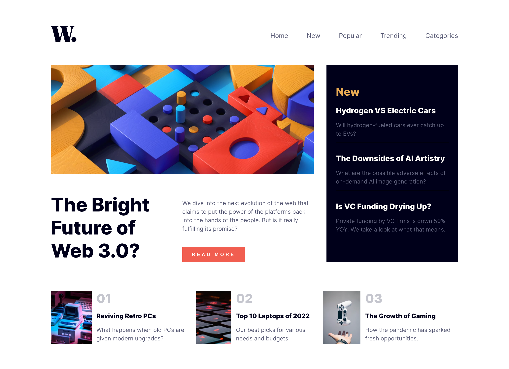

# Frontend Mentor - News homepage solution

This is a solution to the [News homepage challenge on Frontend Mentor](https://www.frontendmentor.io/challenges/news-homepage-H6SWTa1MFl). Frontend Mentor challenges help you improve your coding skills by building realistic projects. 

## Table of contents

- [Frontend Mentor - News homepage solution](#frontend-mentor---news-homepage-solution)
  - [Table of contents](#table-of-contents)
  - [Overview](#overview)
    - [💪 The challenge](#-the-challenge)
    - [🖼 Screenshot](#-screenshot)
    - [🔗 Links](#-links)
  - [My process](#my-process)
    - [🧰 Built with](#-built-with)
    - [📝 What I learned](#-what-i-learned)
    - [⚙️ Continued development](#️-continued-development)
    - [📡 Useful resources](#-useful-resources)
  - [Author](#author)

## Overview

### 💪 The challenge

Users should be able to:

- View the optimal layout for the interface depending on their device's screen size
- See hover and focus states for all interactive elements on the page

### 🖼 Screenshot

For mobile size screenshot, please check at the root file with the title `phone-size.png` and `phone-size-menu.png`

### 🔗 Links

- Solution URL: [Add solution URL here](https://your-solution-url.com)
- Live Site URL: [Add live site URL here](https://your-live-site-url.com)

## My process

### 🧰 Built with

- HTML 
- CSS custom properties with Sass Framework
- Flexbox
- [React](https://reactjs.org/) - TypeScript

### 📝 What I learned
1. BEM naming 
2. CSS (change of mental model)

### ⚙️ Continued development

### 📡 Useful resources

- [Example resource 1](https://www.joshwcomeau.com/css/understanding-layout-algorithms/) - This helped me for XYZ reason. I really liked this pattern and will use it going forward.

## Author

- Website - [Avery Chin](https://www.your-site.com)
- Frontend Mentor - [@yourusername](https://www.frontendmentor.io/profile/yourusername)
- Github 

